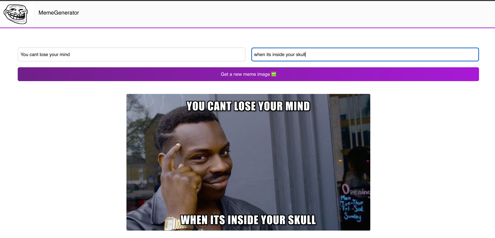

<h1 align="center">
    Meme Generator App
</h1>
 

  Built using React and the <a href="https://imgflip.com/api" target='_blank'>Imfglip API</a>

 
 

     
<!--     <a href="https://www.cryptaul.xyz/" target='_blank'>View Demo</a> -->
    <a href="https://github.com/awar7118/memegenerator">Report Bug</a>
    |
    <a href="https://github.com/awar7118/memegenerator">Request Feature</a>
  

  
"# meme-generator" 
